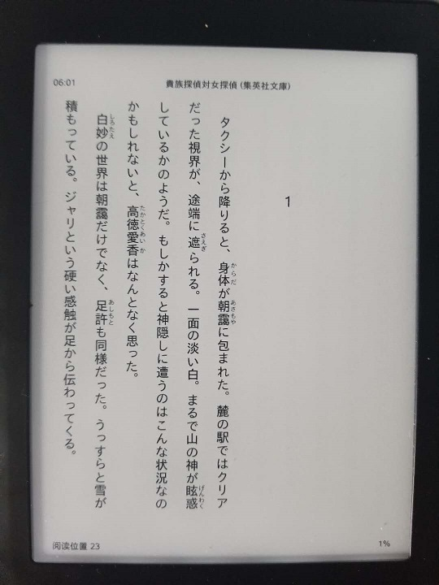
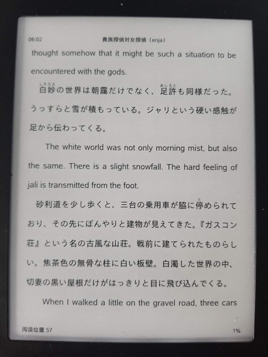

# ja-epub-translator
Translate japanese epub into english one.
very early stage version.

Change log
--
* v0.3 Support OpenAI API
* v0.2 Add new translator, now support jp-cn translation. Code from `http://github.com/neverneverendup/Translator`
* v0.1  Initial version

Demonstration 
--
- Origin epub



- Translated epub




Requirement
--
```
pip install -r requirements.txt

```

Usage
--
1.  Use [Calibre](https://calibre-ebook.com/) to convert any e-books to Calibre formatted epub.
2.  Setup base_url & api_key in aitranslator.py
3. `python runner.py --input input.epub --output output`


Limitation
--
- Only supports the epub files coverted by [Calibre](https://calibre-ebook.com/) for now.

More details TBA.
--
